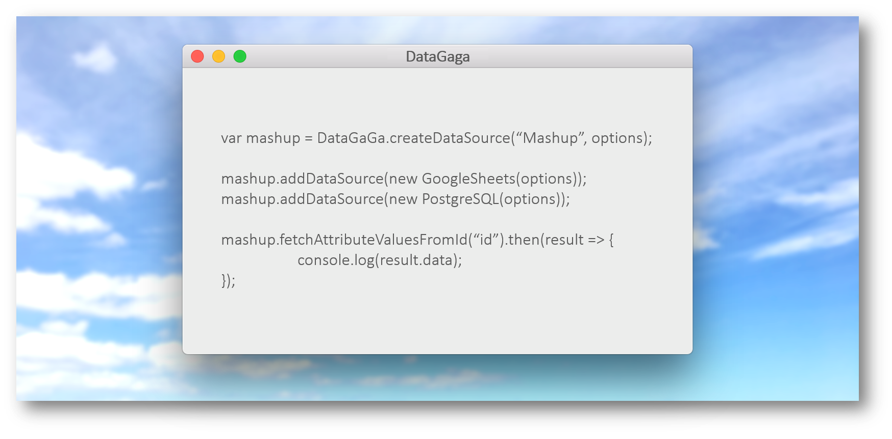

# ***DataGaga*** - A manager for web data sources :earth_africa:



All data sources unite! 
A uniform JavaScript API for processing multiple data sources across the web.
The included data sources can be "fused" together to become one single mashup data source!

**Note**: **This project is under active development, so stay tuned!**

### :gift: What is it?
Have you ever had too many web services and data sources all over the internet 
and found it too cumbersome to save every single one of them?
You only care about data and not where they are stored and how they can be retrieved?

No worries no more! *DataGaga* is a library to manage and organize the 
data sources on the web in one place. 
We define a general concept to support almost all popular data sources online. 
Not only can such data sources be imported from different providers and places, 
they can be combined as one single mashup data source for your convenience.
You just need to declare the data source(s) you'd like to include, we take care of the rest.

### :globe_with_meridians: How it started
In the field of Geographic Information System (GIS), besides displaying geometric 3D models (like buildings, bridges and tunnels),
it is often required to enrich these models with thematic information,
such as heights, numbers of stories, construction years, etc.
Such data are however often provided from various web services and providers,
which introduces many problems:
+ The sheer number of the resource URIs will only increase as more and more data sources are involved,
and developer sometimes lose track of which URI belongs to which data source and for what purpose.
+ Each web data service or provider has their own standard and syntax to access to the hosted data.
Morover, the responses also often differ vastly between web services.
+ Sometimes an object may have its data stored in different locations
and it is difficult to handle all of these at once.   

For example, you'd like to query your own tables hosted in the following services:
+ Google Spreadsheets
+ PostgreSQL
+ Oracle

Normally you would have to treat them separately in your code because 
they have different API syntax structures and protocols.
Using our tool: 
+ You only need to declare these data sources once;
+ You can then query your data easily in one place regardless of the syntax 
and structure differences between the different APIs;
+ You can even treat all of them as one single data source and query/display their data in one single call.

### :electric_plug: Installation

Copy and import the JavaScript file [DataGaga.js](build/DataGaga.js) into your web project. 
(We are working on providing an import link such as or similar to CDN.) And that's it, you're all set up!

### :hammer: Build manually
Simply compile the all the TypeScript files in folder [ts](src/ts). 
This will generate one single JavaScript file [DataGaga.js](build/DataGaga.js) located in the folder [build](build). 

[comment]: <> (TODO Provide a CDN link.)

### :monkey: How do I use this?
1. :seedling: First declare an ``options`` object for your data source:
    ```javascript
    var options = {
        name: "My Data Source 1",
        type: "Table",
        provider: "The Provider",
        uri: "https://link.to.your.datasource"
    };
    ```
    where:
    + ``name`` ``(optional)``: the name of your data source 
    + ``type`` ``(optional)``: the type of your data source
    + ``provider`` ``(optional)``: the provider of your data source
    + ``uri`` ``(required)``: the URL to your data source

    [comment]: <> (TODO Provide a more detailed documentation on the options.)

1. :herb: Initialize data source:
   ```javascript
   var googleSheetsDataSource = new GoogleSheets(options);
   var postgreSQLDataSource = new PostgreSQL(options);
   var kmlDataSource = new KML(options);
   
   // alternatively, you could use the controller
   var googleSheetsDataSource = DataGaga.createDataSource("GoogleSheets", options);
   var postgreSQLDataSource = DataGaga.createDataSource("PostgreSQL", options);
   var kmlDataSource = DataGaga.createDataSource("KML", options);
   ```
   
   [comment]: <> (TODO Provide a more detailed documentation on the parameters of the constructors.)

1. :palm_tree: *(Optional)* If needed, the created data sources can be combined into one single mashup data source:
   ```javascript
   var mashupDataSource = new MashupDataSource(options);
   mashupDataSource.addDataSource(googleSheetsDataSource);
   mashupDataSource.addDataSource(postgreSQLDataSource);
   mashupDataSource.addDataSource(kmlDataSource);
   
   // to remove KML data source
   mashupDataSource.removeDataSource(2);
   ```

1. :tada: Start querying, both individual and mashup data sources have the same methods:
   ```javascript
   mashupDataSource.fetchAttributeValuesFromId(id)
   .then(function(result) {
       console.log(result);
   }.catch(function(error) {
       console.warn(error);
   }));
   ```
    where:
    + ``id`` ``required``: the ID of the object to be queried
    
    [comment]: <> (TODO Provide a more detailed documentation on the structure of the KVPs.)
    
    [comment]: <> (TODO Provide a more detailed documentation on functions responseToKVP and others.)
    
    [comment]: <> (TODO Provide a more detailed documentation on functions queryUsingId and others.)

[comment]: <> (TODO Provide a more detailed documentation on the getCapabilities.)

### :muscle: How do I declare my own data sources?
For your convenience, we already include Google Spreadsheets and PostgreSQL (more to come!) both in JavaScript and TypeScript.
But if you know a popular data source that is not included, please let us know in the 
[issue section](https://github.com/tum-gis/mashup-data-source-service/issues), 
and perhaps we could define it for you!

Otherwise if you are a power user, you can declare your own data source(s) in a TypeScript file. 
Have a look at our codes [here](src/application).
We are working on a more detailed documentation on this, so stay tuned!

[comment]: <> (TODO Provide a more detailed documentation on how to declare own data sources.)


